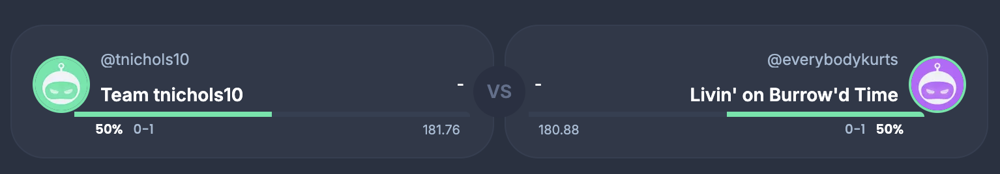

# Week 1

Great first week in catch club!

Check out the awards that Sleeper posts in the league chat and congrats to our champion Max on scoring the most points this week with 180 points.

## Fun with Google Gemini

I took the socres from the matchups in week1 and team names put together some AI prompts with a "He-Man" theme. I posted the prompt and resulting picture below. enjoy!

## RogerGoodell beats Loud & Stroud 160 to 149

prompt:
> Roger, an old portly ruler of the No Fun League, kept the wizard "Loud and Stroud" out of the  Monday Night Football party. I want to see the moat gates crashing infront of the wizard and Roger up on the wall.

## Max beats Mad Season 180 to 173

prompt:
> Defending and shirtless barbarian Champion of the realm Max won a close battle versus the heritic "Mad Season". There is smoke and people celebrating. The he-man sword is raised high in the air by Max. The heretic is cowering. Do it in the style of he-man.

## Old Man beats Tee Nick 137 to 92

prompt:
> Old Man the ancient robot shook off the rust and clubbed the young knight "Tee Nick." The robot's one eye glows red, and Tee Nick is holding his head. Do it in the style of he-man.

## Dirty Bird swoops in on Mahomes for the Holidays 105 to 88

prompt:
> Dirty Bird swoops down from the air and snatches away the princess from kermit the frog, with an afro, in a red football uniform named "Mahomes for the Holidays". Do it in the style of he-man. Kermit is distraught and there is a lot of action.

## Chubby Time beats Livin on Burrow'd Time 161 to 124

prompt:
> Chubby Time the orge put the amazing gem out of reach for archer "Livin on Burrow'd Time". The orge is laughing mightly and the archer is visibly angry. Do it in the style of he-man.

## BWag kicks 26 points to beat Cooper Pooper Trooper 135  to 119

prompt:
> "B Wag" the centar rears back and lets loose a flury of kicks to flatten the knight "Cooper Pooper Trooper". Do it in the style of he-man.

## Happy Ending stuffs All in that 5-Hole 171 to 121

prompt: 
> Do it in the style of he-man. There is pointing and laughing from the crowd. Someone is playing an accordian. "Happy Ending" the jester is dancing and the spotlight is on him. The prince is sad in the stocks. His hands, and feet are in the stocks. There is an extra hole that is unused in the stocks that is labeled. The label is "5th hole".

# Good luck next week!

Match-up of the week for week 2 is Tee Nick vs Everybody Kurts. Both are 0 - 1 and projected to score over 180 points!

## See you next week, Skeletors!

