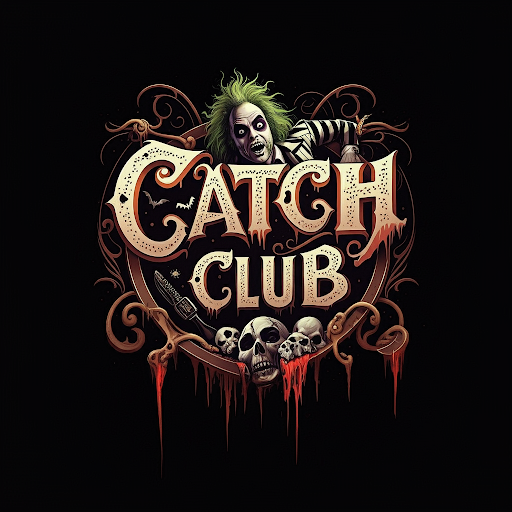
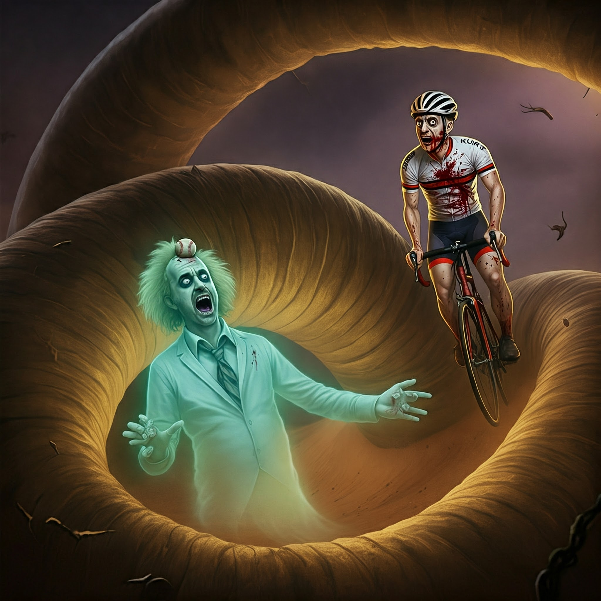
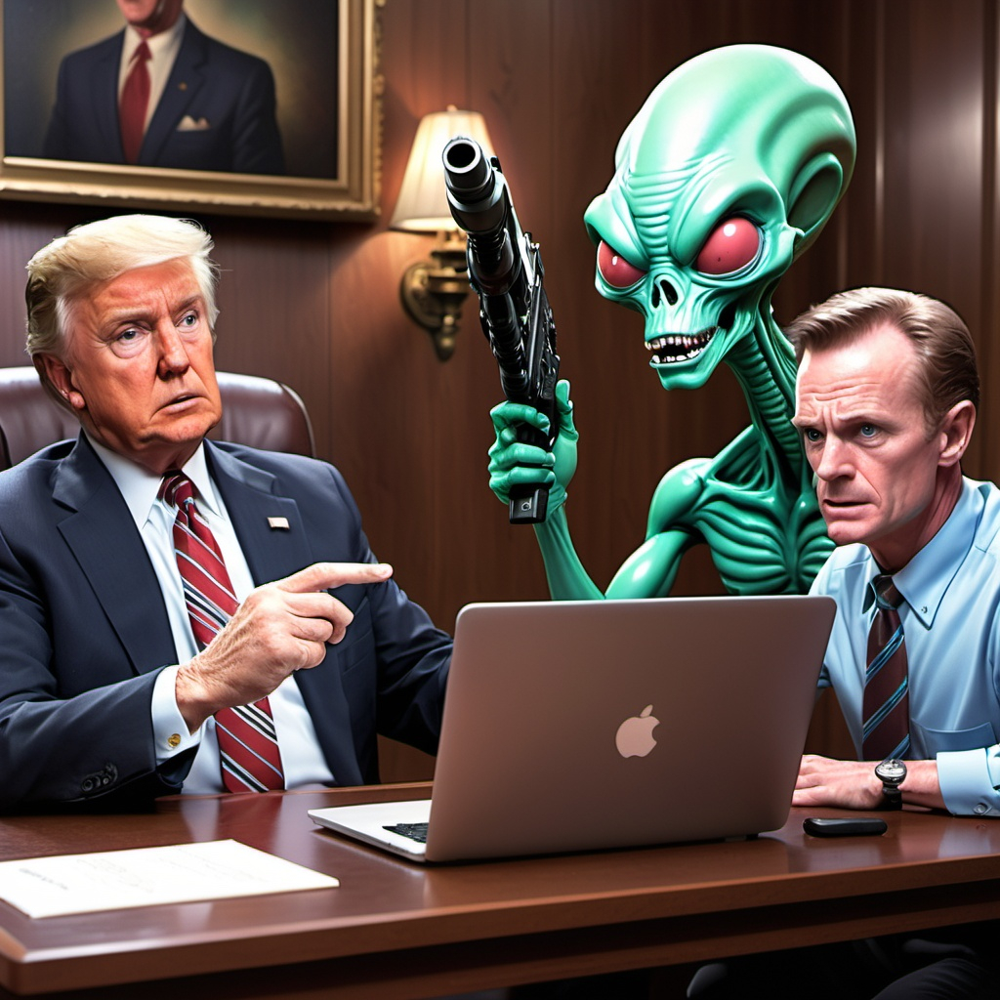
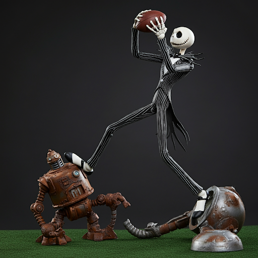
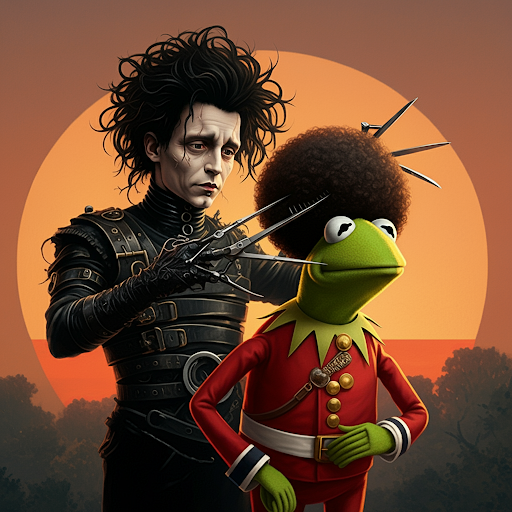
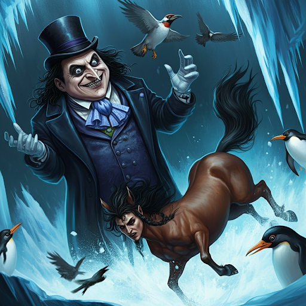
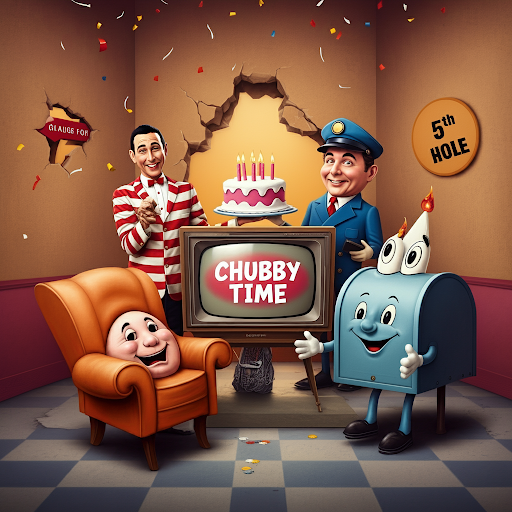
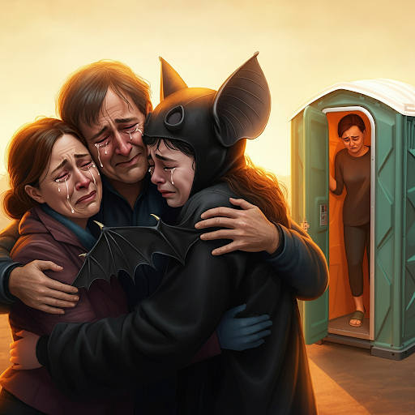
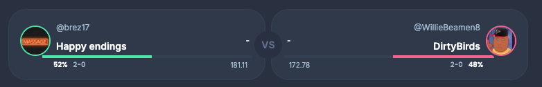

# Week 2



Week 2 is here, but where is the offense? Maybe we can say Mahomes three times in a row? The themes for the matchups are all based on Tim Burton movies.

## Match Up of the Week: Tee Nick versus Living on Burrow'd Time


Scores are way down, and we see that in our matchup of the week. Both were expected to score big, over 180 points a piece, but EverybodyKurts and his team Burrow'd Time ended up winning 128 to 110.

prompt:

```
Create an image of a recently deceased ghost Tee Nick who is about to get eaten by a sandworm. Kurt is riding the sandworm.
Tee Nick is a ghost that looks like a like he died from a baseball lodged in the side of his temple. Kurt looks like a guy who died riding a bicyle. Give him a spandex bicyclist outfit and a helment that is bloody and has a piece of iron sticking out of it. Do the image in the style of Beetlejuice ghosts. 
```



## RogerGoodell vs Max

Roger was no match for defending champ Max, losing 158 to 126. 20 points from his kicker Fairbairn!

prompt:
```
An alien fires a ray gun at the president of the league, Roger, who is sitting at his laptop. Max looks like an alien from Mars attacks. Give the Alien a nametag that reads "Max". Rodger looks very concerned.
```




## Loud & Stroud vs Team OldMan

In the week's closest game, Loud and Stroud came out on top 154 to 146.

prompt:
```
Jack Skellington catchs a touchdown pass like Odell Beckman by leaping over a rusty old robot.
```



## Mad Season vs Mahomes for the Holidays

In another battle of 0-1 teams, Mad Season beat Mahomes for the Holidays 161 to 126,


prompt:
```
Edward Scissorhands, from the movie, trims the afro of kermit the frog, who has an afro, in a red football uniform named "Mahomes for the Holidays". Kermit looks upset.
```



## Dirty Birds vs Team BeeWags

In another close matcher, the OG Dirty Bird The Penguin topples BeeWag 172 to 159. BeeWag got the manager of the week for setting a perfect line-up, so I guess he has got that going for him. Dirty Bird remains undefeated.

prompt:
```
a danny devito inspired Penguin villian from Batman laughs as a centaur falls in an icy pit. Birds are flying around. Penguins are flapping. The centaur is kicking.
```



## All in the 5 Hole vs Chubby Time

Chubby time remaines undefeated in a low-scoring affair, beating All in the That 5 Hole 114 to 92.

prompt:
```
Pee-Wee Herman and the entire fun house celebrates when the phrase of the day "chubby time" is announced. A personified chair is celebrating. A mailbox personified is celebrating. A mailman is celebrating. A large tv personified is celebrating. The 5th hole, a hole in the wall that is labeled "5th hole" is not celebrating. create an image.
```



## Cooper Pooper Trooper vs Happy Endings

The highest score of the week and the biggest blowout belongs to Happy Endings! Winning 181 to 137.

prompt:
```
A batman-like person gets a happy ending by reuniting with his parents who give him a hug. Batman is overjoyed. A sad person looks back at that happy family while stepping into a porta-john.
```



# Match-up of the week for week 3

In a battle of the undefeated, who will come out on top? Will it be a Happy Ending or will the Dirty Birds fly away with another win?



