# Week 3

Yada, yada, yada and bang, we're on week 3. *So succinct!*

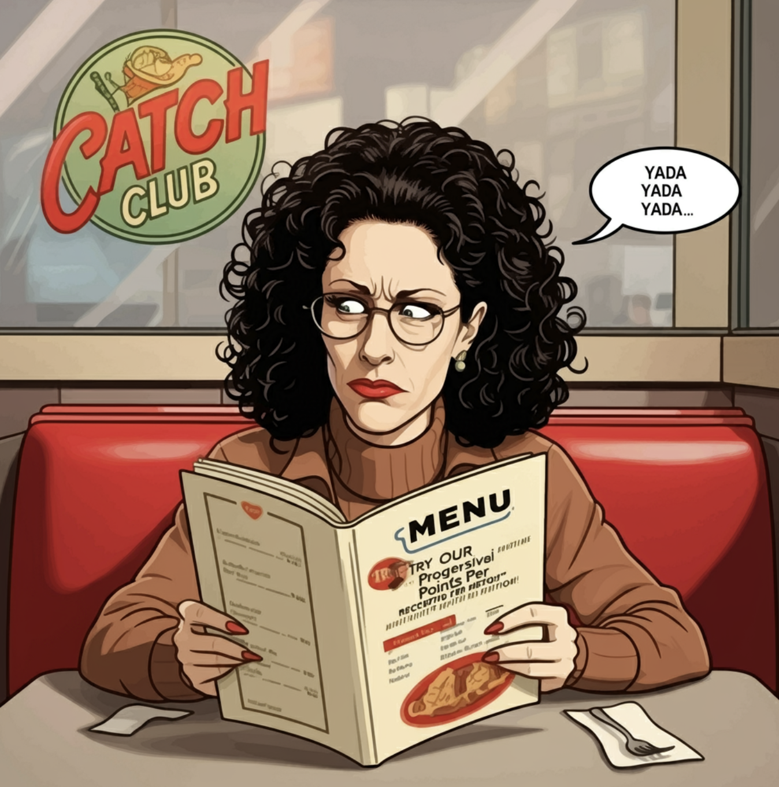

---

## Match Up of the Week: Happy Endings vs Dirty Birds

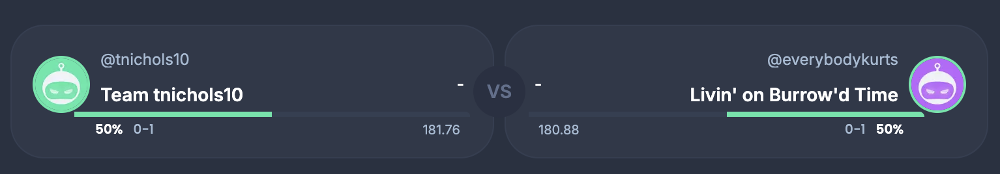

Dirty Bird is truly master of his domain, and the domain of Catch Club. There was no release for Happy Endings losing 121 to 151

prompt:

> 4 cartoon pigeons are dressed up as seinfeld's Jerry, George, Elaine, and Kramer. the Kramer bird is slamming $50 dollars on the kitchen counter, there are action graphics, and a BAM sound effect like in a comic by the action. The kramer bird has a dialogue bubble, announcing "Im out." The other carton pigeons look surprised.

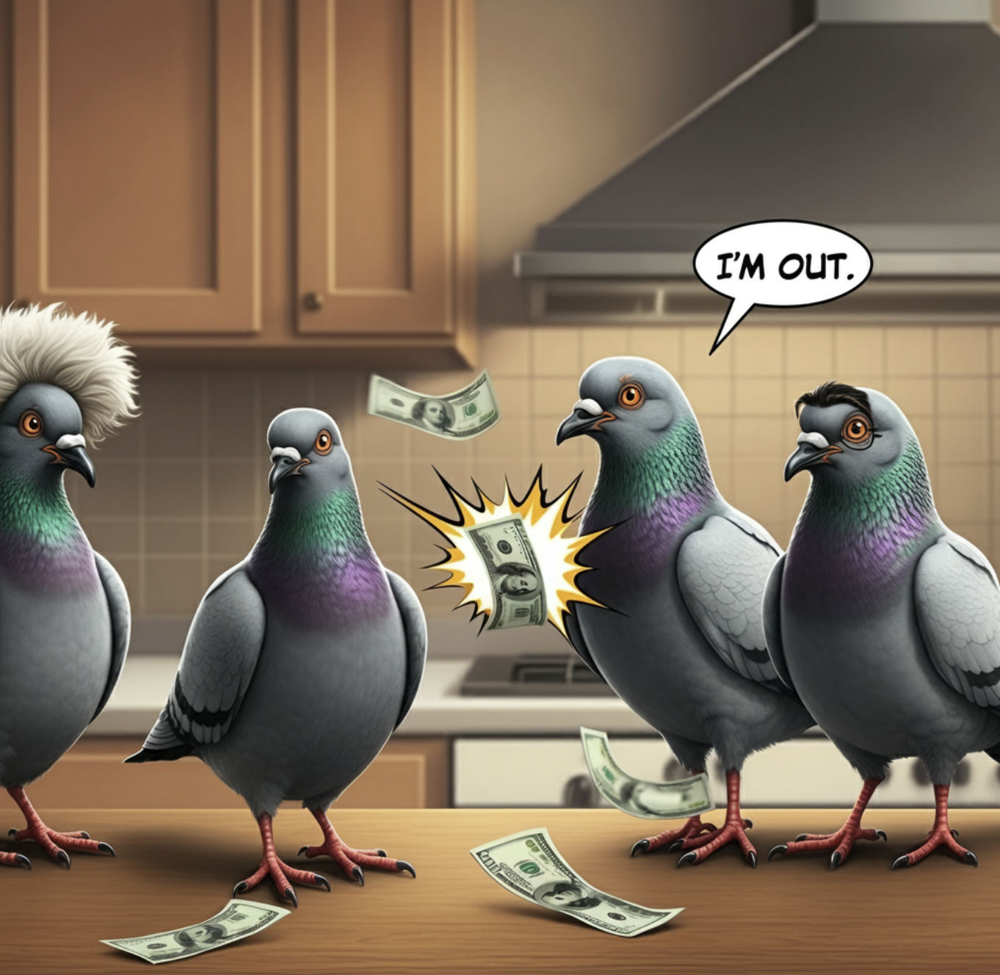

---

## RogerGoodell vs Old Man

It was tough week. The Human Fund is in the Red, and the strike is back on at the bagel shop. The Old Man wins in a Feat of Strength 166 to 145.

prompt:

> want a cartoon depiction of a bald, heavy, new yorker, with some hair, in in khakis and a checkered shirt getting wrestled on the ground by an older version him. Have the older version wearing a shirt with a sweater over top of it. The Older version has a dialogue bubble saying, "ive got a of problems with you people!"  There is a big banner that says "Festivus for the Rest of Us". There is an alunimum pole under a spot light to a side. The bald new yorker looks scared.

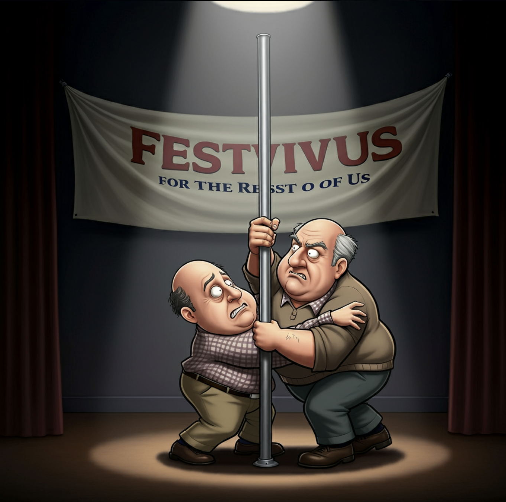

---

## Max vs Mahomes for the Holidays

You know, sometimes you go to the waiver wire, you're there first, and you pick up a wideout who scores 3 TDs, goes for 175 yards, scoring 51 points. Then someone swoops in, and grabs the win! You say, "But that's not the point, I was here first, I should get the win!"

But if you got the win, you would have won

**You know, we're living in a society! We're supposed to act in a civilized way!**

prompt:

> draw in a cartoony way. a heavyset balding new yorker is standing in the middle of a chinese restaurant.  He is wearing kahki pants, and a checked shirt, and glasses. A dialogue bubble says "We're living in a society! " He is very angry and the angle of the shot is low, and it looks like he is powering up like a dragon ball z hero.

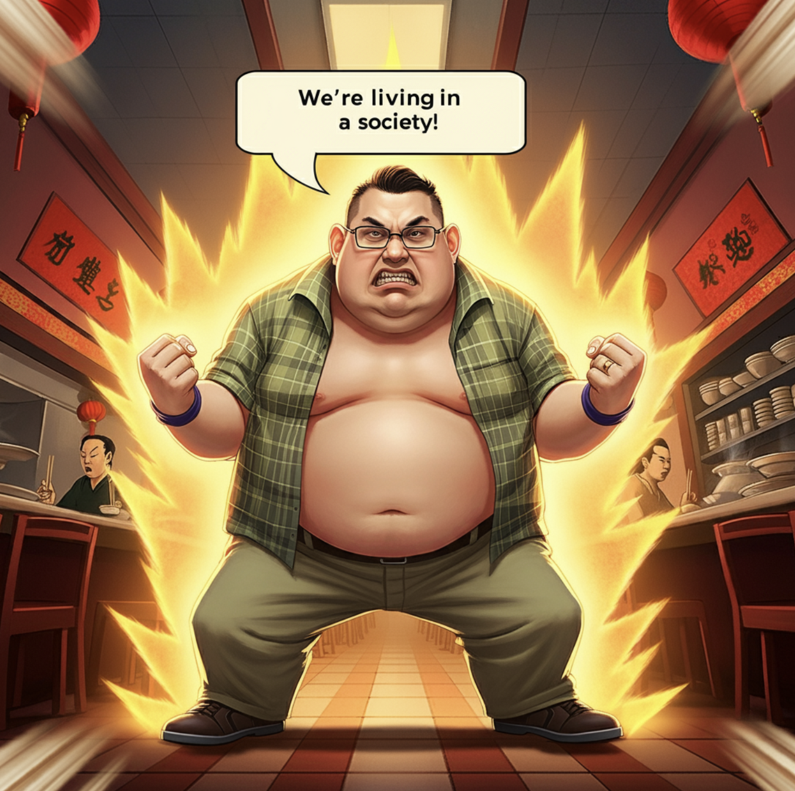

---

## Tee Nick vs My Ball Zach Ertz

It was intense! Probably going to be the closet game in our league we see this season. Tee Nick beat My Ball Zach Ertz (Best Team Name!) by less than a point! 117.15 - 116.75

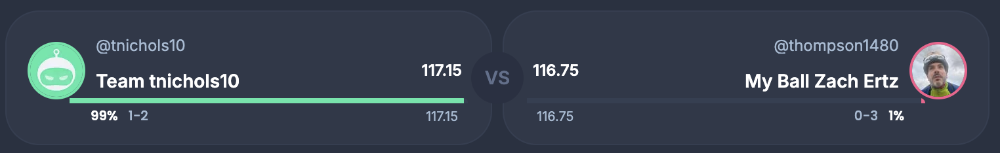

0.4 Difference! 

MBZE was right there at the end, but broke out their Scent of a Woman impression at the wrong moment, and NO SOUP FOR YOU!

*NEXT!*

prompt:

> An Armenian man, who is clean cut, wearing kitchen whites, has dark features and a mustache behind a soup counter with a raised ladle. He is  yelling with a dialogue box angerily, " NO SOUP FOR YOU!". The yelling is directed at a bashful and sad large football player on the other side of the counter. The football player is wearing a red and yellow themed uniform and wears number 86. There is also a postal worker featured who is very happy and excited with his soup order. His dialogue bubble says "jambalaya". His is a very large postal worker with small hands.

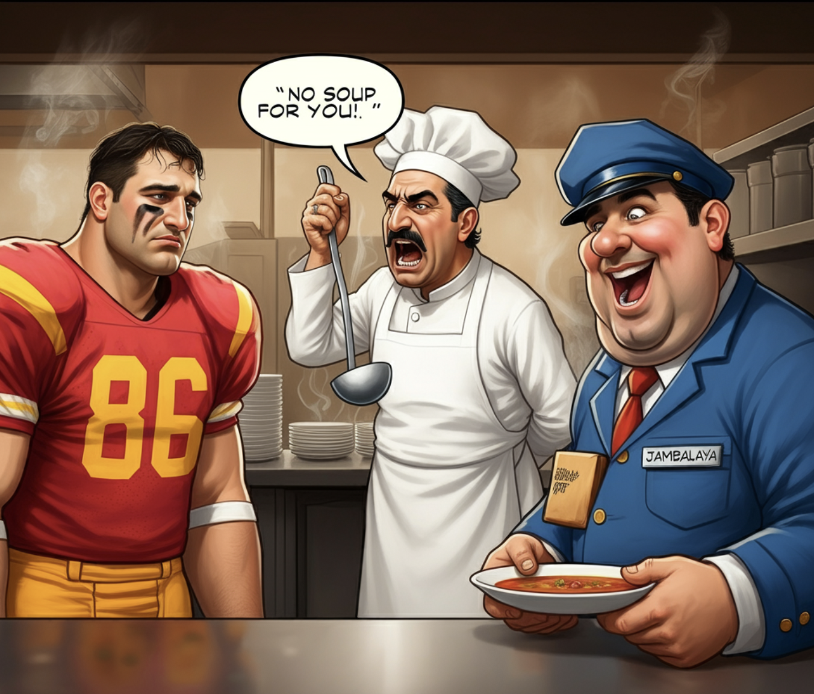

---

## Living on Burrow'd Time vs Loud N Stroud

Loud N Stroud won with the 3rd least points this week and swimming in the pool with Living on Burrow'D time in the Hamptions. Talk about shrinkage!

HE WAS IN THE POOL! HE WAS IN THE POOL!

prompt:

> There is a frightened turtle, with glasses and a balding head for some reason. The turtle is wearing red swim trunks. Football players from around the NFL are pointing and laughing at the turtle.

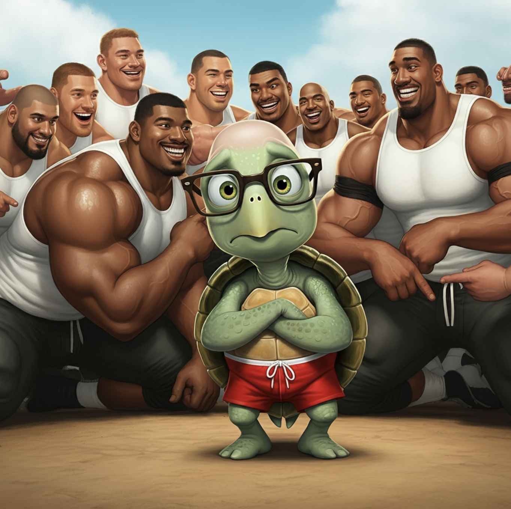

---

## Team BWag vs Mad Season

Team BWwag **MAN-HAND**led Mad Season 143 to 113

prompt:

> There are buns expertly baked in the letters that make up "Catch Club" spread on a platter in a well lit, nice looking restraurant venue. A beautiful women with a twinkling smile and sparkling eyes sits in front of dish. She is wearing a tasteful dress. Her hands  are very muscular ,  and reaching in and tearing into a piece of the buns. These hands are very hairy, and vieny. The the nails are painted bright pink. They are wearing expensive rings and bracelets.

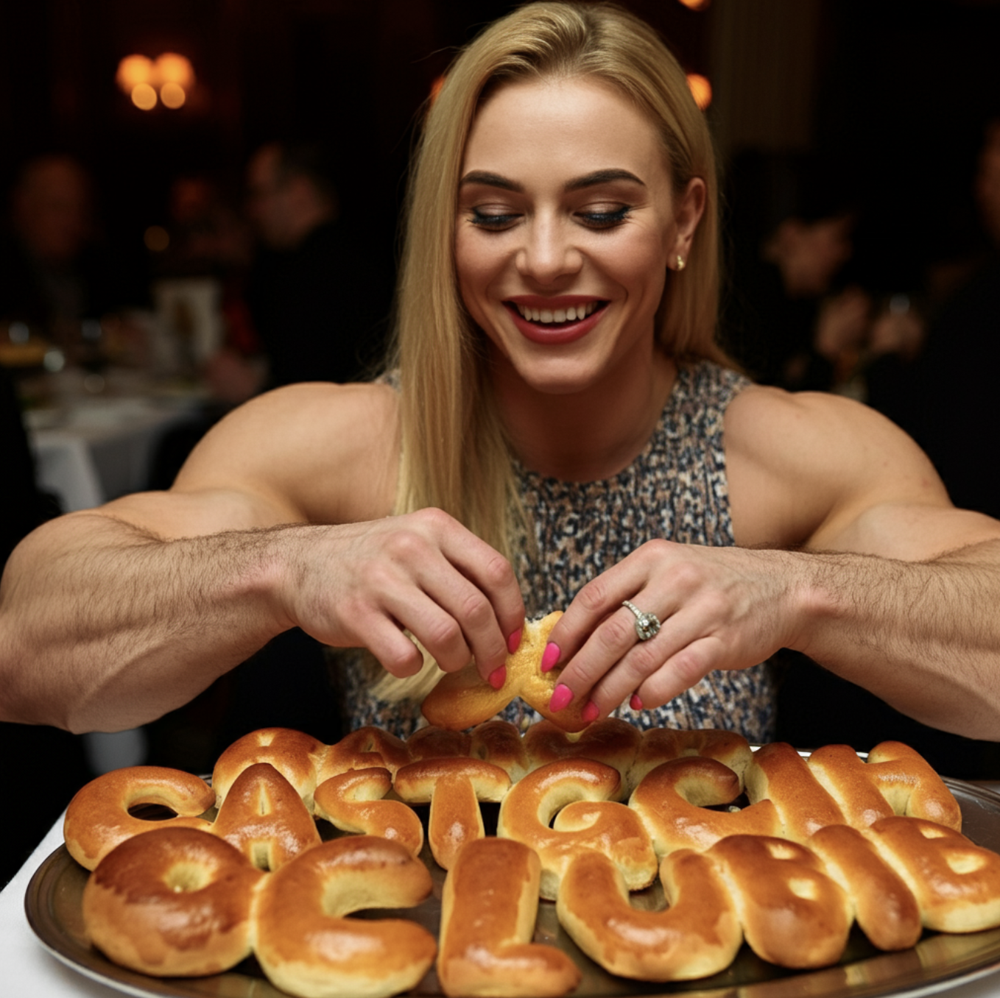

---

## Cooper Pooper Trooper vs Chubby Time

Chubby Time says:

> these pretzels, they're making me... THIRSTY

> THESE PRETZELS! ...they're making me t h i r s t y

> These pretzels, (panting) THEY'RE MAKING ME THIRSTY!

Cooper Pooper Trooper responds saying, "No, you see, its no good. You don't know how to act. Im working on it."

> Boy, these pretzels, they're making ME thirsty

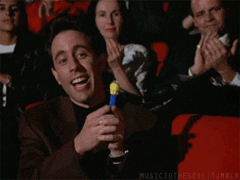

prompt:

> a black football player wearing a uniform like the Cleveland browns with brown and orange and the number 2. The player overacts holding a pretzel bag high tightly, straining in the warrior 2 pose, holding a large pretezel skyward. There is a spotlight on the pretzel.

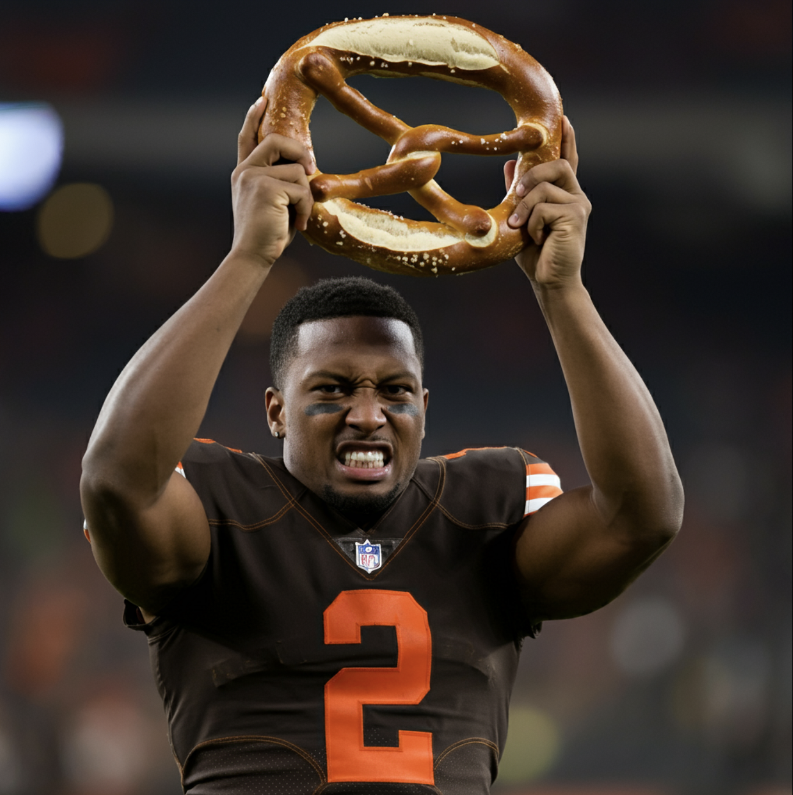

# Match-up of the week for week 4

Team BWag (record 2 - 1) is favored over defending champ Max (record 3 - 0). Who will come out on top?

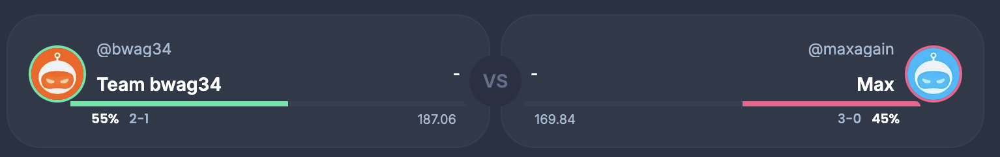

# See you next week!

Later you old bags!

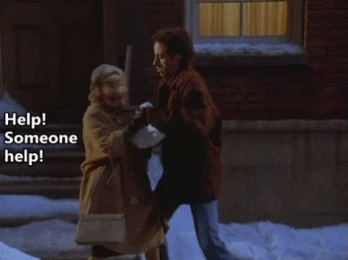

