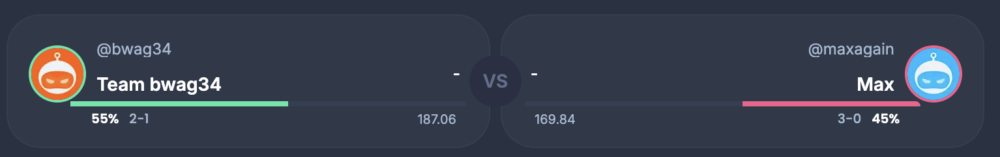
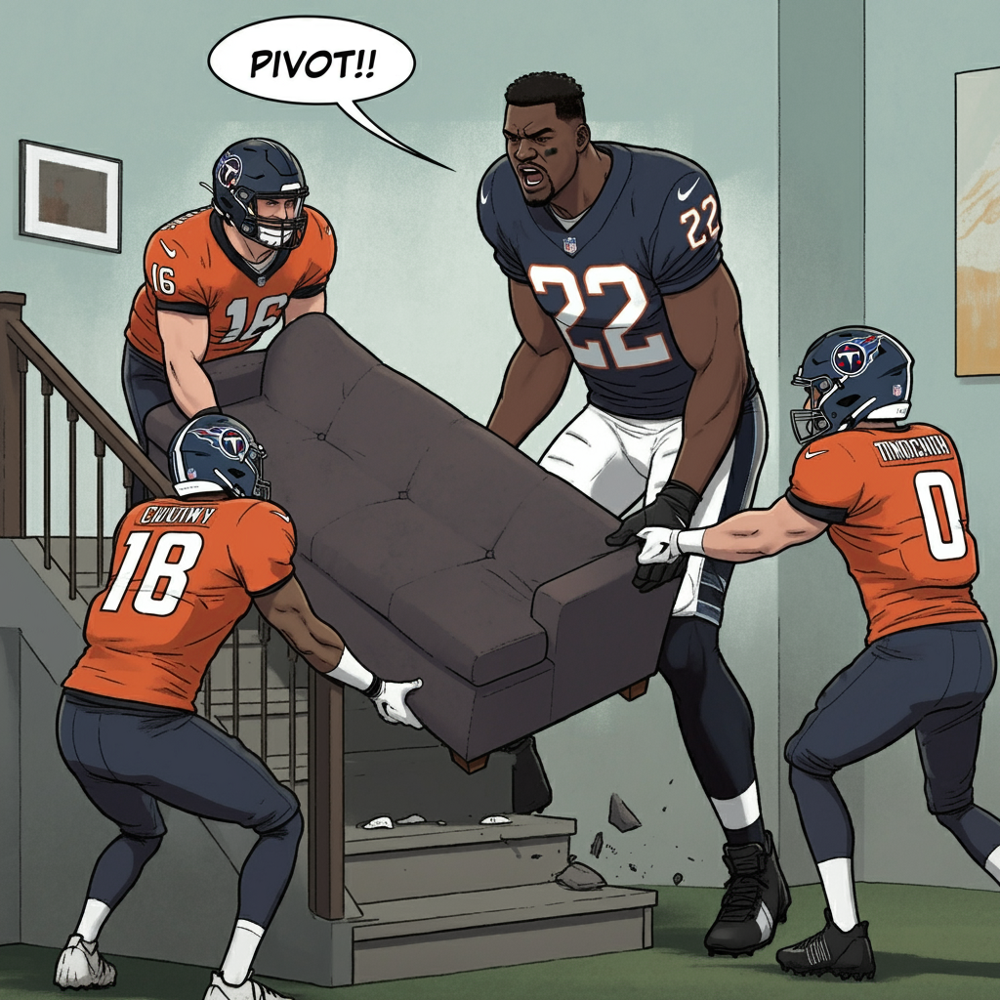
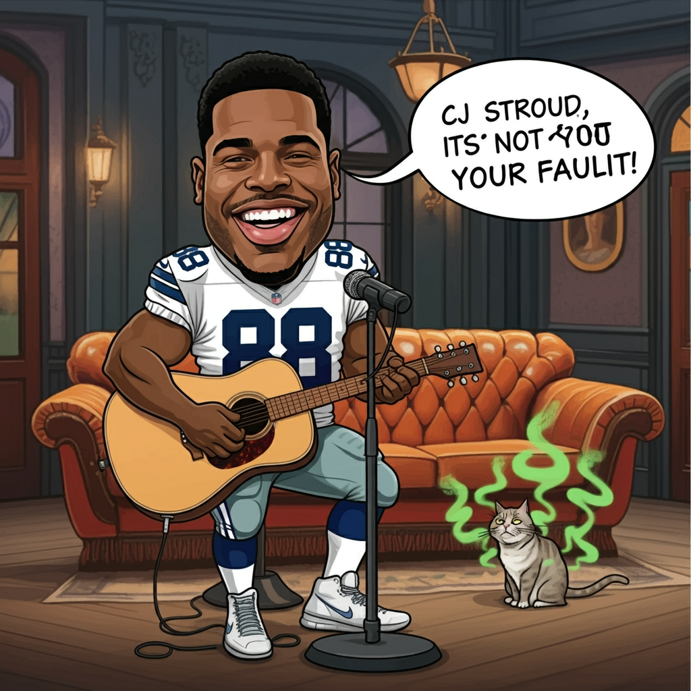
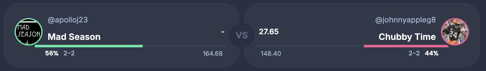

# Week 4

So no one told us the season was going to be this way! Da Da Da Da DAAA!

---

# Match-up of the week: Team BWag vs Max

The league was getting stressful, roster choices were made, and some unfortunate things were said. They decided to take a break. 

One thing led to another, Max was out making copies, and ended up losing 169 to 126 to Team BWag

prompt:
> A black quarterback in a baltimore ravens jersey ,with the number 2 and a dark visor, is visbily dismayed when his ex-girlfriend Jennifer Anniston breaks up with him again, after discovering he slept with a woman. The quarterback is saying in a speech bubble, "we were on a break!". There is a kinkos bag.

---

## Living on Burrow'd Time vs Old Man

Saving on delivery charges by not starting players who get zero points is not a way to move a couch into your apartment. Old Man defeats Living on Burrow'd Time 133 to 116.

prompt:

> 4 NFL players are trying to move a couch together. They are wearing helmets except for the number 22 running back. There is number 16 detroit lions jersey. There is a number 9 jersey for the cincinnati bengals. There is tennesse titans jersey number 0. There is also black running back in a number 22 ravens jersey. The number 22 running back is literally twice the size of everyone else. They are trying to move a couch up some stairs that has a landing, and it is not fitting or working. Everyone is frustrated. The number 22 running back is yelling in a speech bubble , " Pivot! Pivot!". I need an image. You can make it cartoon like.

---

## Roger Goodell vs Mahomes for the Holidays

Mahomes for the Holidays takes the win after Roger Goodell could not answer a trivia question.

prompt:
> A Chicago Bears running back #4 and a Kermit the frog with an afro in a red football uniform #15 are riding a dog statue on wheels into an apartment they won. 

---

## My Ball Zach Ertz vs Loud n Stroud

It was close, CJ turned in a great game, but it was not meant to be. MBZE edges out Loud n Stroud, 137 to 126

prompt:

>A black dallas cowboy wide receiver is singing while playing an acoustic guitar while sitting on a stool. His number is 88. He is playing in the central perk coffee shop like in friends. He has a speech bubble with musical notes around it, saying "CJ Stroud, CJ Stroud, its not your fault!" Make it cartoon like. Make sure the speech bubble includes the "CJ Stroud, CJ Stroud, its not your fault!". Also, add a disheveled looking  cat  to the side with green wavy lines coming off of it like it is smelly. The cat is looking at the singer in a confused way. 

---

## Mad Season vs Happy Endings

Mad Season and Nico were celebrating turkey day early with a big week over Happy Endings, 154 to 110.

*had some trouble getting this image created but this image was hilarious*

prompt:

> A black player in a houston texans jersey is wearing a huge turkey on his head. There are big sunglasses on the turkey and he is dancing.

---

## Cooper Pooper Trooper vs Team T Nick

Team T Nick and Baker are feeling good after a big win against Cooper Pooper trooper, 147 to 169.

prompt:

> a buccaneers player #6 is in central perk coffee shop, and is hitting on a young lady saying, "how you doin'?" I need a speech bubble and an image.

---

## Chubby Time vs Dirty Birds

Dirty Birds continue their undefeated streak, beating Chubby Time 167 to 123. So annoying.

prompt:

> Chandler from Friends in cartoon form is looking at the league standings, and says to himself in a speech bubble, "Can Dirty Birds BE anymore undefeated?"

---

# Match-up of the week for week 5

Two teams sitting at 0.500, and looking to move up the rankings. We have Mad Season (record 2 - 2) vs Chubby Time (record 2 - 2). 

---

# Until next week

Your commish is 1 - 3... so this is how I am feeling.

