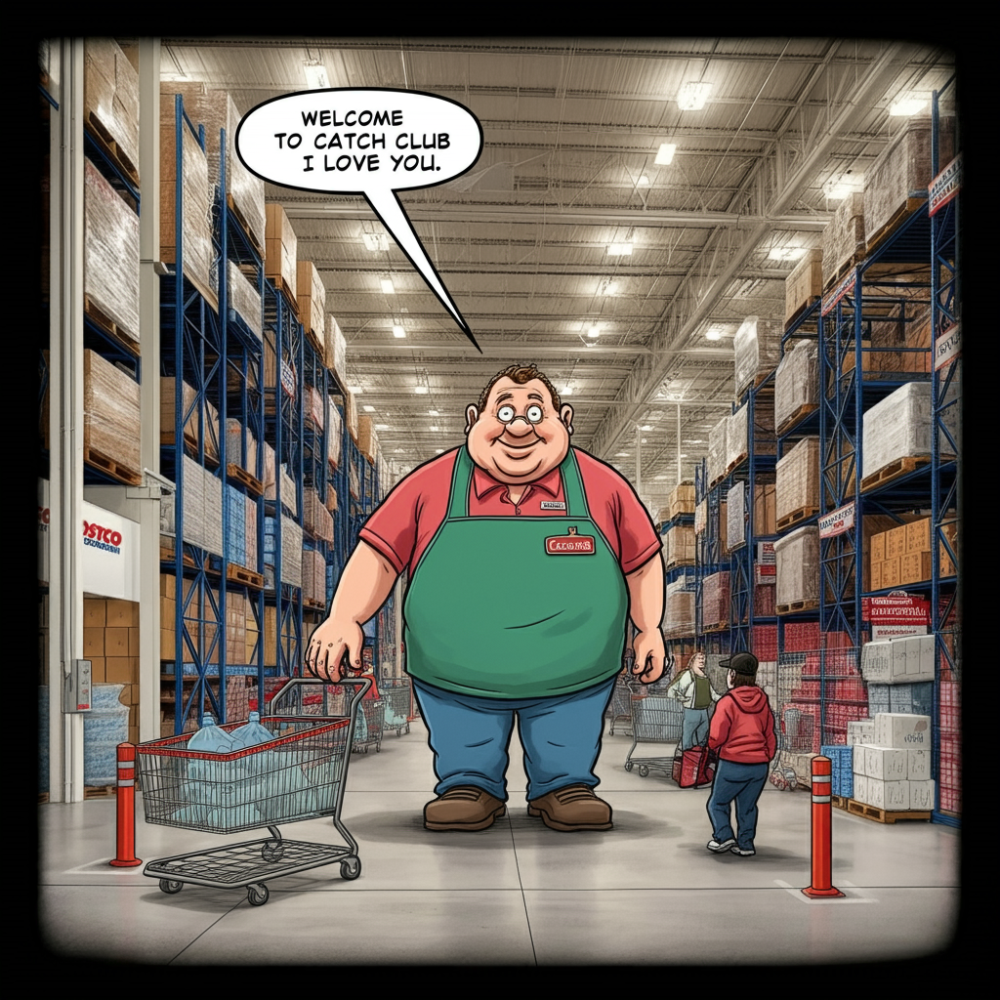
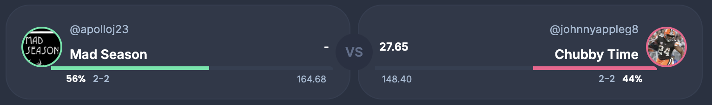
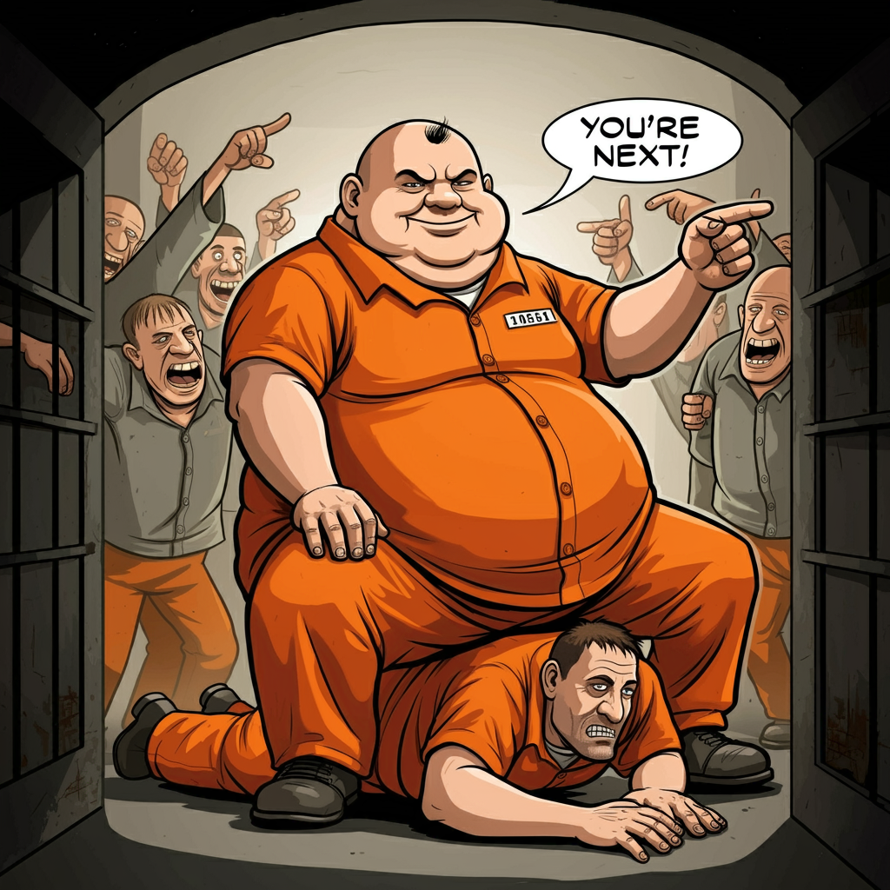
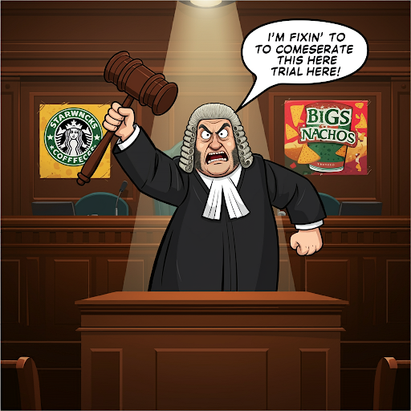
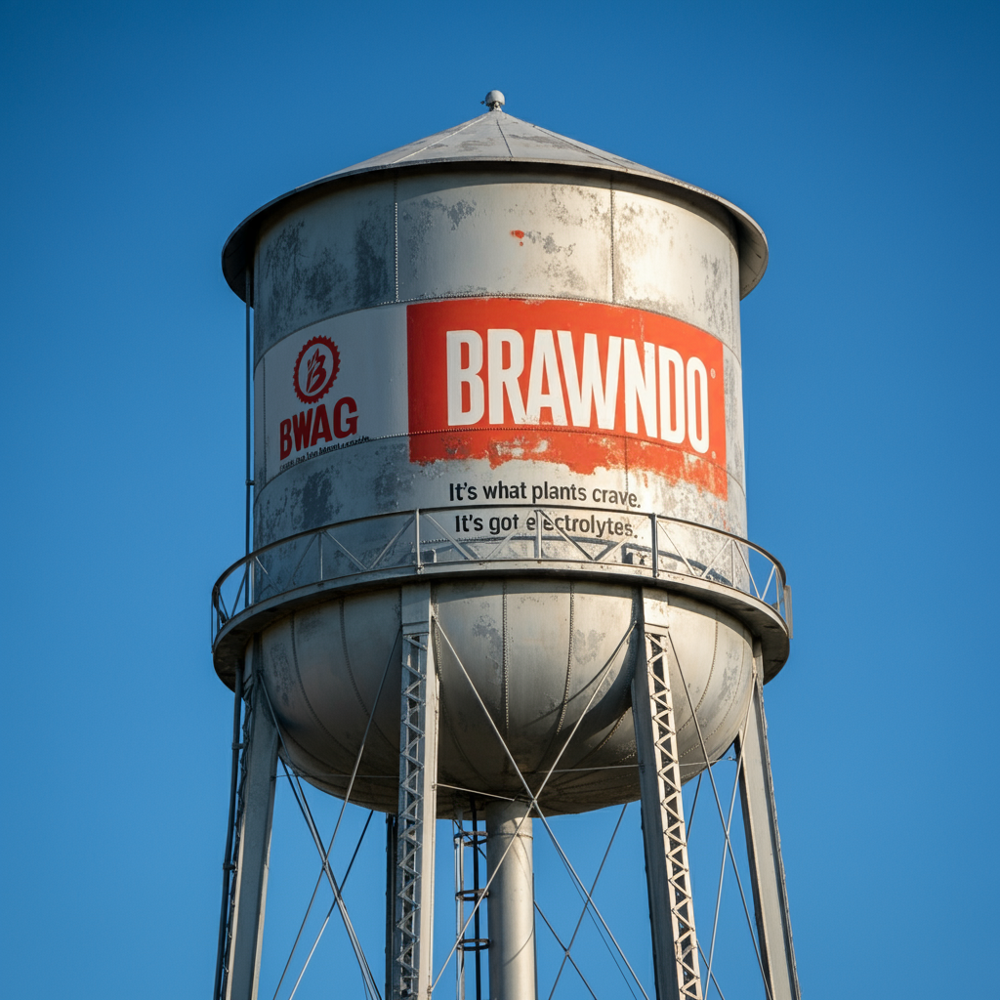
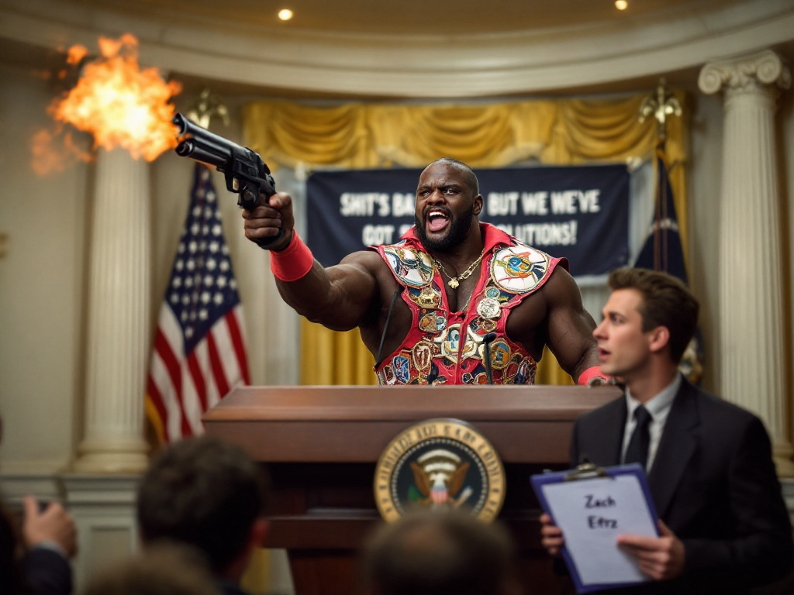
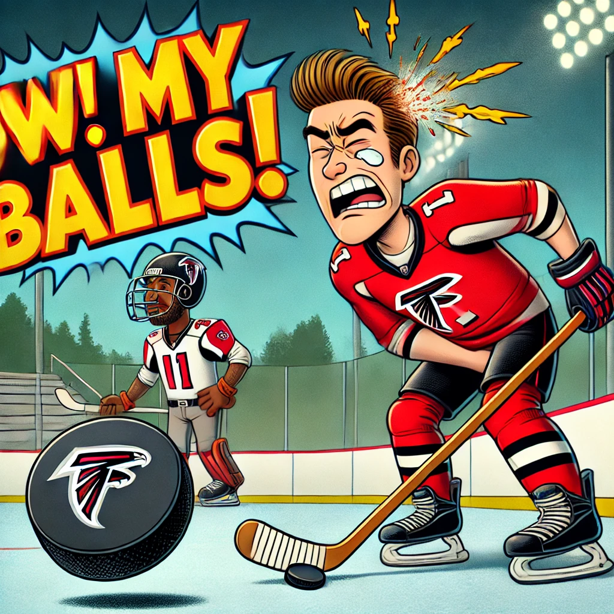
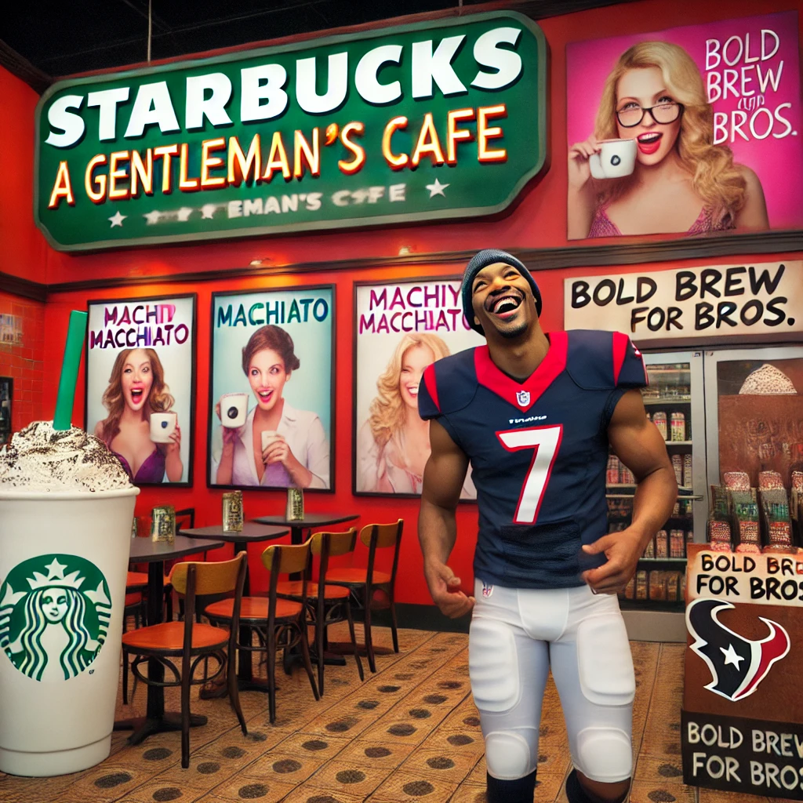
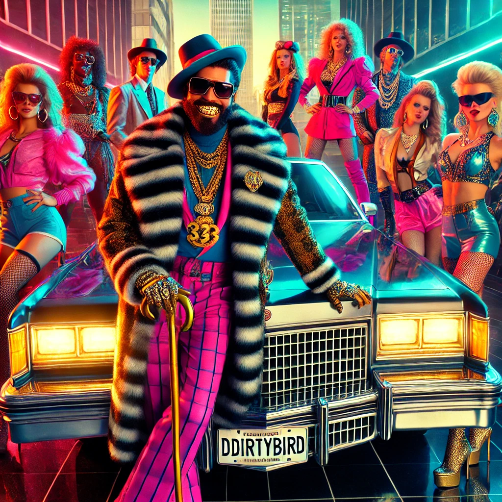
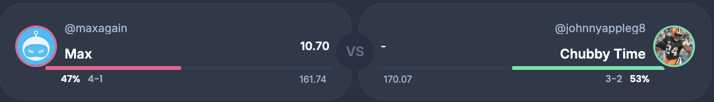

# Week 5

[Welcome to Catch Club. I love you](https://www.youtube.com/watch?v=ZIFCWpn4qQ4)

Idiocracy week! Came out in 2006, and one of the best movies ever. [Best opening scene ever](https://www.youtube.com/watch?v=sP2tUW0HDHA).

---

# Match-up of the week: Mad Season vs Chubby Time

Chubby Time wastes no time parking the caboose and securing a win against Mad Season. Mad Season was sure he was supposed to be getting out with the win this week. He faces defending champ Max next. Chubby Time wins 142 to 131

Max,[don't get in the wrong line while being a partical individual who is facing Chubby Time](https://www.youtube.com/watch?v=P9xuTYrfrWM).

prompt:
> an obese prisoner namer Chubby Time is in orange and is sitting on another prisoner. The person doing the sitting has one arm on his hip and the other is pointing at the camera. Many prisoners are pointing and laughing. The large prisoner is staring at the camera in a satisfied and grim look. need a cartoonish image. The chubby time prisoner is saying in a speech bubble, "youre next"

---

## Roger Goodell vs Living on Burrow'd time

Roger Goodell looked at his 1-3 record, and said, "[We gone see, if we can come up with a verdict up in here](https://www.youtube.com/watch?v=MfifauG93ZU)." 

Number one, your honor, just look at him? And B, we got all this like evidence, and shit, against Living on Burrow'd Time. And, I heard he doesn't even have his tattoo. Roger Goodell wins, 131 - 98.

prompt:
> Need a cartoon image of an old large man named Roger Goodell with a crazy hairstyle similar to wolverine, is wearing a judge outfit, in a courtroom sponsered by brawndo, starbucks, and big ass nachos. The jude says, A "im fixin to comeserate this here trial here". He is holding a huge 3 foot gavel. There is a spotlight on him. Make it cartoonish. The ads are on the walls too. I need the speech bubble. refine the image. only hair like wolverine. no claws. 

--- 

## Team BWags vs Mahomes for the Holidays

Team BWag is riding a 3 game win streak and [has obviously got what plants crave](https://youtu.be/GFD2ggNxR1g?si=MLTA74IC31DXPzKh&t=75). Wins easily 180 to 141.

prompt:
> Team Bwag is what plants crave. Because he has electrolytes. I need an ad for brawndo sports drink that is on a water tower.

---

## My Ball Zach Hurtz vs Team OldMan

[President Camacho knows shits real bad right now, with all the losses and shit, but he's got a solution](https://www.youtube.com/watch?v=ig446isvXlI).

Team OldMan tried to say, "I got a solution! You're a dick! Sprinfield what's up!"

President Camacho responds with some gunfire to quite the crowd. "I know everyones shits emotional right now! #1, we got this guy Zach Ertz. #2 he's got a higher IQ than anybody, and #3 he is going to fix everything!" MBZE wins, 153 to 150

prompt:
> president camacho winning a closely contested election over an old man who gives off a crafty vibe. President camacho is a large black man who is holding an ak 47 and firing it into the ceiling. there is fireworks behind him. the house of representatives are his audience and they look like they are getting rocked by a great band.

---

## Happy Endings vs Max

Happy Endings chance to extend the defending champs losing streak to 2 weeks [ended painfully](https://www.youtube.com/watch?v=FWfOMeLk6m0) in an 180 - 129 point lose thanks to the output of Darnel Mooney and 34 points. 

prompt:
> create a promotional image for a show called "ow! my balls!" and the image includes a hockey player in pain getting hit in the groin by a hockey puck from slapshot from an Atlanta Falcons football player wide receiver who is wearing a # 1 jersey. 

---

## Cooper Pooper Trooper vs Loud & Stroud

There was no time for erotic coffee for men for Cooper Pooper Trooper as they took advantage of a sub-par game from CJ Stroud to win, 169 - 149.

prompt:
> Create an image of a red-light district Starbucks offering erotic coffee for men. CJ Stroud from the Houston Texans can be seen walking into the starbucks.

---

## Team TNich vs DDirtyBirds

D-D-I-R-T-Y-B-I-R-D - for a **double-dose** of his winning.

DDirtyBird agreed to be in our league for this year after an agreement with local authorities for certain leeways in running his, *pimp game*. First however, there was the difficult challenge of gaining his trust.

**Collins, skip to the technicals please**

[You see, a pimp's love is very different from that of a square](https://www.youtube.com/watch?v=rVKlsP8C4Ns)... **COLLINS!** DDirtyBirds wins 5th straight 159 - 105. 

prompt:
> Create an image. DDirtyBird is on the license plate of a very nice cadilac from the 1980s. A flamboyant man with a fur coat, walking cane, dark sunglasses, teeth grill, and a lot of jewelry is posing with some of his lady friends who are hanging on him. They are dressed very nicely in short skirts, big hair, and jewerly as well. They seem proud and are poising next to the cadilac.

---

# Matchup of the week for next week: Max vs Chubby Time

4-1 Max versus 3-2 Chubby Time. Can Chubby Time make it 2 in a row against the defending Champ or can Max keep pace with an ascendant DDirtyBird?

